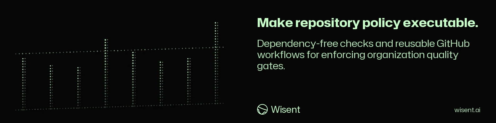

<!-- wisent-banner:start -->
<p align="center">
  
</p>
<!-- wisent-banner:end -->

<!-- wisent-readme-signals:start -->
[](https://github.com/wisent-ai/quality-control) [](https://github.com/wisent-ai/quality-control/issues) [](https://wisent.com) [](https://discord.gg/qRjpkthq54) [](https://www.linkedin.com/company/wisent-ai/) [](https://x.com/wisentai) [](https://calendly.com/lbartoszcze)
<!-- wisent-readme-signals:end -->

# Wisent Quality Control

The Rules You Keep Repeating in Code Review, Enforced Before You Read the Diff.

Every team has the same four arguments on every pull request: a commit subject
that says "fix stuff", a silent fallback that will hide the next outage, a number nobody can explain six months from now, and a
desktop application that shells out to its product instead of using an API. Writing them into a style guide
changes nothing, because a style guide is not a gate. Quality Control turns those
rules into one required workflow and four scripts you can run before you commit,
so the argument happens once and then never again. It reads only the lines your
change actually touched, and it answers with the file, the line, the rule, and
what to do instead — not a red cross on a job called `lint`. Seven Wisent
repositories already merge through it.

**Wisent Quality Control is a small, dependency-free Node.js policy toolkit and
reusable GitHub workflow for rejecting vague commit subjects and selected forms
of newly introduced lexical gates, implicit fallback behavior, magic
constants, and desktop applications coupled to a product command-line interface.**

It is a source-review guard, not a compiler, semantic analyzer, security scanner,
proof of correctness, or substitute for product-specific review and tests.

[Quick start](#quick-start) · [Policy contracts](#primary-interfaces) ·
[Organization rollout](#organization-enforcement) ·
[Canonical repository](https://github.com/wisent-ai/quality-control)

Current boundary: public development source under Apache-2.0. The repository
contains reusable scripts, a composite action, an organization-ruleset installer,
and GitHub workflows. It does not promise a published npm package, immutable
release channel, hosted dashboard, or support SLA.

## Problem and intended users

A repository fleet can require pull requests and still accumulate unauditable
commit history or repeatedly introduce implementation patterns the organization
has prohibited. Copying slightly different checks into every repository makes the
policy drift and makes remediation hard to explain.

Quality Control serves:

- **repository maintainers** who need the same changed-line guards locally and in
  pull requests;
- **organization administrators** installing one required workflow on default
  branches;
- **reviewers** who want file, line, rule, source, and remediation-oriented
  findings rather than a generic failed gate;
- **migration owners** auditing an existing repository without immediately
  blocking on all historical findings.

## Product boundaries

### Included

- informative commit-subject evaluation for pull-request, merge-group, and push
  event payloads;
- changed-line scanning for suspicious keyword/phrase gates;
- changed-line scanning for selected hidden fallback/default patterns;
- changed-line scanning for significant string and numeric literals embedded in
  logic;
- desktop-repository scanning for product-CLI process launches and command
  strings in user-visible text;
- `--all`, `--staged`, `--worktree`, `--base`, and `--range` scan modes;
- a reusable required GitHub workflow for pull requests and merge queues;
- an organization-ruleset installer targeting all repositories except the host;
- a manual, non-blocking repository baseline-audit workflow;
- dependency-free Node.js execution (Node 20 or newer).

### Explicit non-goals and limitations

- The guards are regex- and line-oriented heuristics, not AST or type-aware
  analysis. They can miss multi-line/novel forms and can flag legitimate code.
- A passing guard does not establish security, correctness, maintainability,
  accessibility, license compliance, or test coverage.
- The keyword guard identifies selected natural-language comparisons and named
  lists; it does not determine whether an algorithm is semantically biased or
  whether a classifier is appropriate.
- The fallback guard prohibits selected defaulting idioms. It does not prove that
  all failures are explicit or that recovery behavior is correct.
- The constants guard exempts imports, named uppercase constants, structural
  values `-1`, `0`, `1`, and `2`, and selected documentation/schema contexts. It
  does not model language-specific constant semantics.
- Test directories and build/dependency directories are excluded by design;
  policies primarily constrain production source.
- The default mode is staged changes. An empty staged diff can pass after checking
  zero files; choose the mode matching the intended review boundary.
- The baseline workflow always exits successfully and uploads findings. It is an
  inventory tool, not a merge gate.
- The provided ruleset requires pull requests but configures zero required
  approving reviews and no code-owner/last-push approval. Add separate review
  policy if required.

### Supported languages and files

| Guard | Scanned source extensions |
|---|---|
| no keyword logic | Swift, MJS, JS, TS, TSX, Python, shell, YAML, JSON |
| no fallbacks | Swift, MJS, JS, TS, TSX, Python |
| no magic constants | Swift, MJS, JS, TS, TSX, Python |
| no desktop CLI coupling | Swift (repositories named `*-desktop` only) |

Common exclusions include `.build/`, `.git/`, `.swiftpm/`, `.work/`,
`node_modules/`, and test paths. Exact exclusions are the source of truth in each
script; they are not guaranteed to remain identical across policies.

## Core use cases

### Guard a staged change locally

- **Actor:** a developer preparing a commit.
- **Initial state:** relevant source changes are staged in a Git worktree.
- **Outcome:** each script exits `0` with a checked-file count or exits `1` with
  file/line/rule findings.
- **Boundary:** only staged added/modified/copied/renamed source lines are checked
  by the default mode.

### Enforce the policy on pull requests

- **Actor:** a repository or organization administrator.
- **Initial state:** the reusable workflow is required by branch/ruleset policy.
- **Outcome:** commit subjects and newly added policy violations block the
  workflow.
- **Boundary:** GitHub availability, workflow permissions, repository checkout,
  and the referenced Quality Control revision remain external dependencies.

### Inventory historical findings

- **Actor:** a migration owner.
- **Initial state:** an existing repository may predate the policy.
- **Outcome:** the manual `Repository audit` workflow uploads four logs, four
  exit-status files, and a summary artifact while leaving the workflow green.
- **Boundary:** the artifact reports heuristic findings; it does not prioritize,
  waive, or repair them.

## How it works

```text
Git change boundary
(staged/worktree/base/range/all)
           │
           ▼
 candidate tracked source files
           │
           ├─ changed line extraction from zero-context Git diff
           ├─ extension and path exclusions
           └─ policy-specific line heuristics
                         │
                 pass or findings (exit 0/1)

GitHub PR / merge group
           │
           ├─ informative-commits composite action
           └─ reusable workflow runs four policy jobs
                         │
                  organization ruleset gate
```

The scripts use Git to resolve the repository root and changed-line boundary.
They inspect current file contents only at selected new-line numbers; deleted
lines do not create findings.

## Quick start

### Prerequisites

- Node.js 20 or newer;
- Git;
- a Git worktree containing the source to inspect.

Run the source scripts directly:

```bash
git clone https://github.com/wisent-ai/quality-control.git
cd quality-control
node scripts/check-no-keyword-logic.mjs --all
node scripts/check-no-fallbacks.mjs --all
node scripts/check-no-magic-constants.mjs --all
node scripts/check-no-desktop-cli-coupling.mjs --all
```

Run against staged changes (the default mode):

```bash
node scripts/check-no-keyword-logic.mjs --staged
node scripts/check-no-fallbacks.mjs --staged
node scripts/check-no-magic-constants.mjs --staged
node scripts/check-no-desktop-cli-coupling.mjs --staged
```

Expected result: each guard prints a pass with its candidate-file count, or prints
one or more `path:line: rule: detail` findings and exits non-zero.

The package also declares these executable names when installed from an approved
source:

- `wisent-check-keyword-logic`;
- `wisent-check-fallbacks`;
- `wisent-check-magic-constants`.;
- `wisent-check-desktop-cli-coupling`.


No public npm availability is promised by this README.

## Primary interfaces

All four source guards accept exactly one mode:

```text
--all
--staged
--worktree
--base <sha>
--range <before>..<after>
```

If no mode is supplied, `--staged` is used. Combining modes or passing an unknown
argument exits `2` with usage. A zero `before` SHA in `--range` becomes an
all-files scan.

### No-keyword-logic

```bash
node scripts/check-no-keyword-logic.mjs --base <base-sha>
```

Flags selected keyword-named identifiers, word-list gates, natural-language
literal comparisons, and regular-expression alternations. Findings recommend
structured state, typed metadata, parser output, or explicit model/classifier
output instead of word matching.

### No-fallbacks

```bash
node scripts/check-no-fallbacks.mjs --worktree
```

Flags selected fallback identifiers, nullish/logical defaulting, optional Swift
`try?`, Python dictionary defaults, promise/catch substitute values, and empty
catch blocks. Narrow source-level exceptions exist for environment lookup,
logging, and selected accumulation patterns.

### No-magic-constants

```bash
node scripts/check-no-magic-constants.mjs --range <before>..<after>
```

Flags selected significant literals in assignment and logic-sensitive lines.
Name the value, derive it from typed metadata, or load it from configuration.
### No-desktop-cli-coupling

```bash
node scripts/check-no-desktop-cli-coupling.mjs --base <base-sha>
```

Runs only in repositories whose name ends in `-desktop`; any other repository is
skipped with a pass. Flags process launching outside the allowlisted
backend-launcher file (a `BackendProcess` or `Runtime` file name), `command:`
arguments on UI panels, and user-visible string literals containing shell
commands, install instructions, or environment assignments. A desktop
application reaches its product over loopback HTTP/JSON, local state files, or
a linked library instead of its command-line interface.

### Informative commit action

```yaml
- uses: wisent-ai/quality-control/.github/actions/informative-commits@main
  with:
    github-token: ${{ secrets.GITHUB_TOKEN }}
    min-informative-words: "2"
```

The action checks the subject (first line), ignores merge commits, recognizes a
Conventional Commit prefix, requires at least 12 characters, and applies token
specificity rules. The token threshold alone is not the full acceptance rule.

### Reusable workflows

Two workflows are consumed by other repositories directly, pinned to an exact
revision rather than a branch, so a change here cannot alter a consumer's gate
until that consumer moves its pin.

```yaml
jobs:
  gates:
    uses: wisent-ai/quality-control/.github/workflows/rust-gates.yml@<sha>
  tag:
    uses: wisent-ai/quality-control/.github/workflows/tag-on-manifest-bump.yml@<sha>
```

`rust-gates.yml` runs `cargo fmt --all --check`, `cargo clippy --all-targets -- -D
warnings`, and `cargo build --locked --release`. It accepts `runs-on`
(`ubuntu-latest`), `toolchain` (`stable`), and `working-directory` (`.`).

`tag-on-manifest-bump.yml` tags the version declared in a manifest exactly once.
It accepts `manifest` (`Cargo.toml`) and `runs-on` (`ubuntu-latest`).

`required-pr-quality.yml` is the required pull-request workflow described above,
and `repository-audit.yml` is the manual, always-green baseline inventory.

Consumers as of 2026-08-11: `brama`, `jeden`, `skarbiec`, `transcript-lake`,
`wisent-backend`, `wisent-integrations`, and `image-video-router`. Pins are not
synchronized automatically; `skarbiec` currently sits on an older `rust-gates`
revision than the other six.

## Organization enforcement

The supplied installer creates an active organization ruleset for default
branches of all repositories except the Quality Control host repository. It
requires pull requests and the host workflow.

```bash
gh auth refresh -h github.com -s admin:org
node scripts/install-org-ruleset.mjs
```

This is a mutating organization-admin operation. Review the script and policy
first. Defaults can be changed with:

- `QUALITY_CONTROL_ORG`;
- `QUALITY_CONTROL_HOST_REPO`;
- `QUALITY_CONTROL_RULESET_NAME`;
- `QUALITY_CONTROL_WORKFLOW_PATH`;
- `QUALITY_CONTROL_WORKFLOW_REF`.

The installer sends a `POST`; it is not an idempotent update command and can
create another ruleset when rerun. The default workflow and script checkouts use
`main`, so policy changes can alter future results without a release-tag change.
Pin an audited revision where immutable policy is required.

## Security and privacy

- Workflow permissions are read-only for contents and pull requests, but the
  installer requires organization-administration authority.
- Findings and audit artifacts can include source lines. Treat logs as source
  disclosure and apply repository-appropriate retention/access policy.
- Do not run unreviewed forks of these scripts with privileged tokens.
- Pin external actions and Quality Control revisions when supply-chain
  reproducibility matters; the included workflows currently use major tags and
  `main` references.
- The informative-commit action sends authenticated read requests to GitHub's
  commits/compare APIs and requires `GITHUB_TOKEN` plus event metadata.
- The ruleset installer creates a temporary JSON request body and removes its
  temporary directory after the API call.

## Operational model

- **Configuration:** command mode, action input, GitHub event environment, and
  optional installer environment variables.
- **State:** Git history/worktree, GitHub event payload, workflow revision, and
  organization ruleset.
- **Credentials:** read token for commit inspection; org-admin `gh` token only for
  ruleset installation.
- **Observability:** stdout pass counts, stderr findings, GitHub annotations,
  workflow job status, and uploaded baseline logs.
- **Failure model:** invalid arguments exit `2`; findings exit `1`; Git/GitHub API
  and file errors fail closed unless the baseline workflow deliberately captures
  the status.
- **Recovery:** fix the source/subject or change an audited policy explicitly;
  rerun the same boundary. Do not suppress a finding by switching to a narrower
  mode.
- **Cost:** GitHub Actions minutes, artifact retention, and reviewer/remediation
  time; no checkout or metering is implemented here.

## Project status and support

- **Maturity:** small public development toolkit; policy behavior is defined by
  source, not a hosted service.
- **Distribution:** source repository and reusable GitHub workflow; no supported
  public npm or immutable binary release is promised.
- **Compatibility:** Node.js 20+ and Git; GitHub organization rulesets require
  appropriate plan/API availability and administrator access.
- **Issues:** [`wisent-ai/quality-control`](https://github.com/wisent-ai/quality-control/issues).
- **Security:** use private GitHub Security Advisories; do not attach private
  source findings, audit logs, tokens, event payloads, or repository inventory to
  a public issue.
- **License:** Apache License 2.0; see [`LICENSE`](LICENSE).